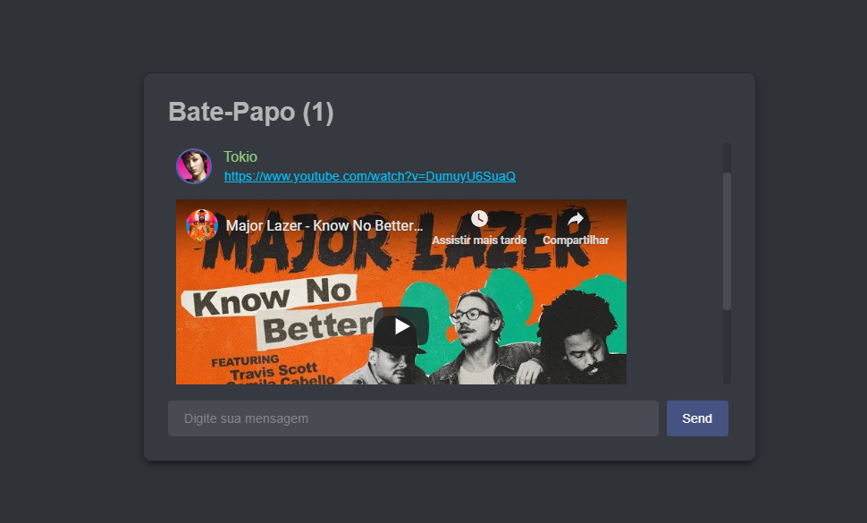

# Xit-Xat
---
Back e Front de uma sala de Bate-Papo que segue o design do Discord utilizando WebSocket. 

  https://xit-xat.herokuapp.com/
 
## Recursos do chat

* Avatar e Nome do usuário.
* Som de notificação.
* Notificação dinâmica no titulo da janela.
* Anexo de links e videos do YouTube.
* Aviso de login/logout de usuários.

## Evolução / Demonstração

